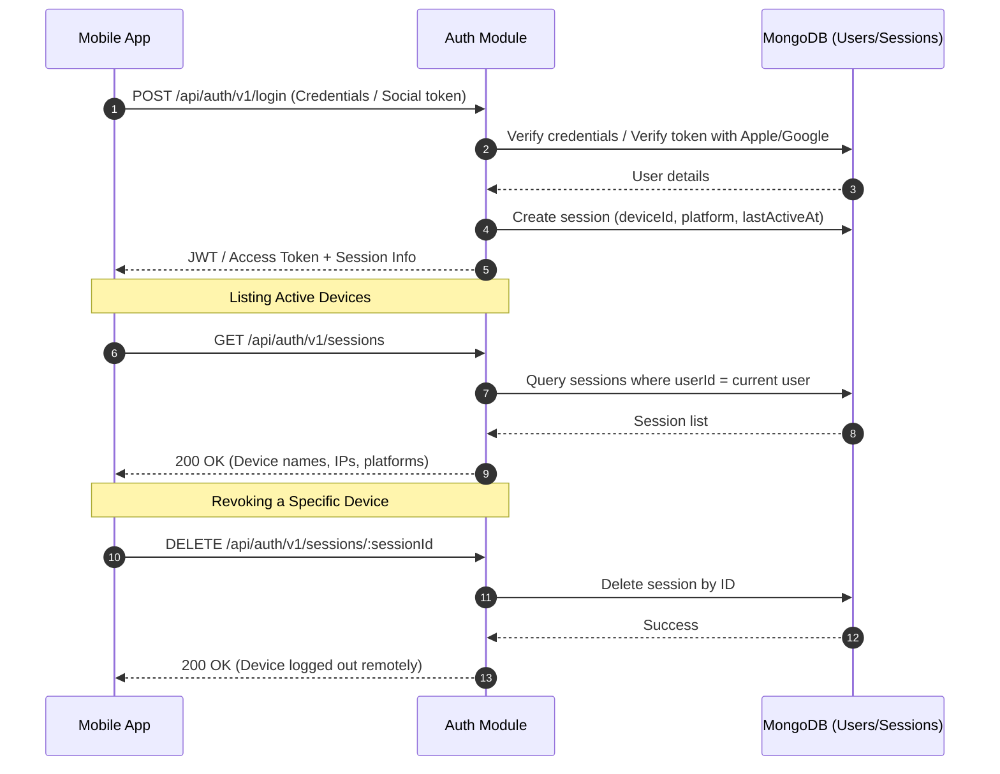
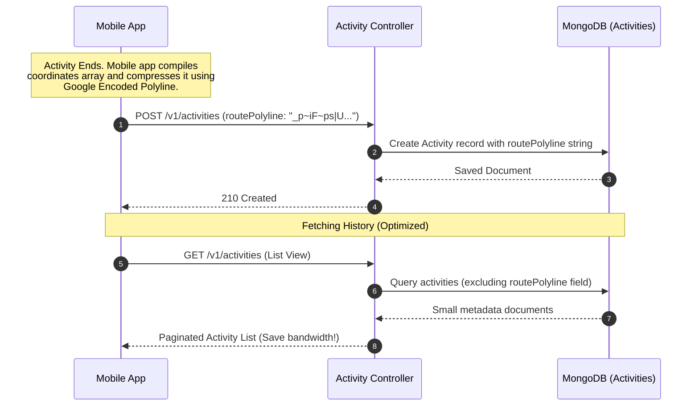
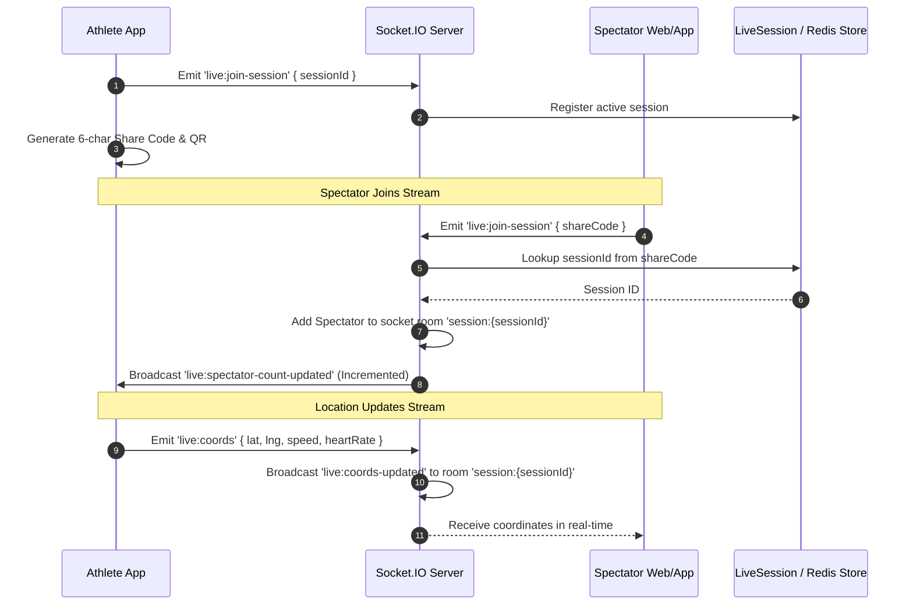
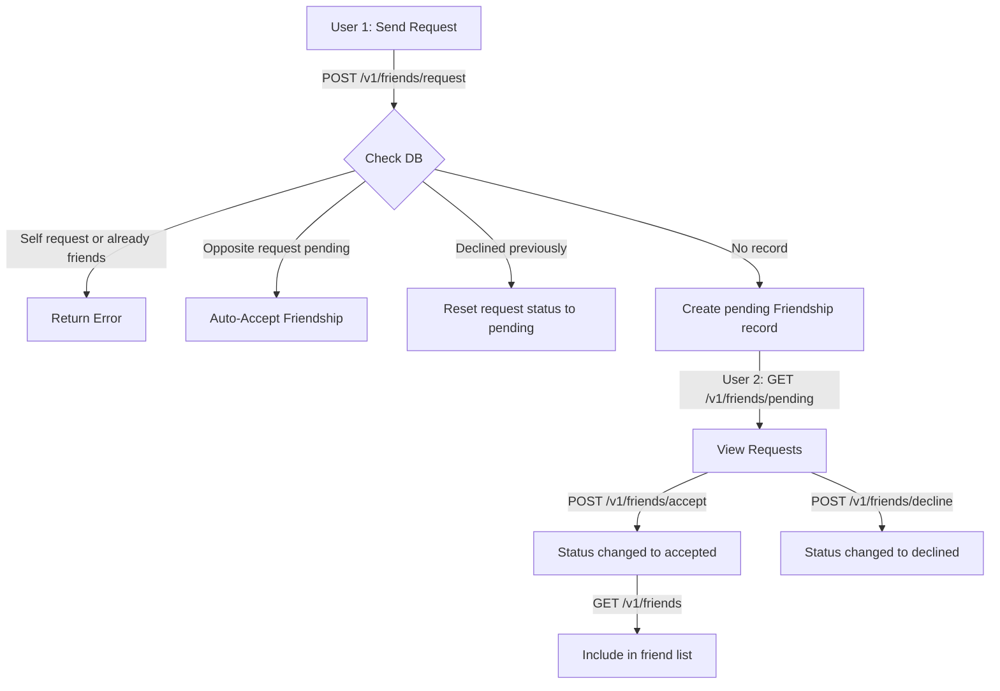
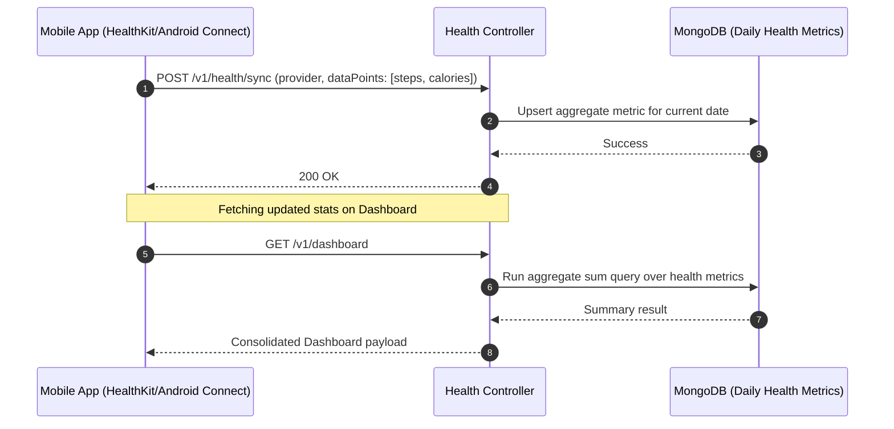

# NexFit/Strava Backend API Reference

This file documents all API endpoints for the backend, utilizing the active development Pinggy HTTPS tunnel.

---

## 1. Live Tunnel & Base URL
*   **Active Server URL:** `https://pix-homepage-efficiency-nations.trycloudflare.com`
*   **Fallback Localhost:** `http://localhost:3000`

---

## 2. Product Flow & Architecture Overview

The NexFit backend is designed for robust mobile and web fitness tracking. Below are the detailed user journeys and system sequence flows.

### A. User Authentication & Device Session Lifecycle
Supports secure email/password and social login, tracks concurrent logged-in devices, and allows users to remotely revoke active sessions.



*   **Session REVOCATION:** Any subsequent request carrying a revoked session's JWT is blocked by `auth.middleware.ts`.

---

### B. Activity Recording & Google Polyline Compression
Optimizes transmission bandwidth and database storage by converting coordinate arrays into a compact base64-like polyline format.



*   **Compression Gain:** Converts large coordinate payloads (often megabytes for long workouts) into small strings.

---

### C. Live Session Sharing & Spectators
Allows users to share real-time GPS coordinates and heart rate via a 6-character short code or a QR code.



---

### D. Bidirectional Friend System
Supports standard social connections for activity sharing and live spectator notifications.



---

### E. Health Ingestion & Metrics Sync
Enables periodic data syncing with Apple Health and Google Health Connect without leaking raw coordinates or micro-data.



---

## 2. Authentication Methods

The backend supports three forms of authentication:

1.  **Bearer Authorization (Mobile/API Clients):**
    *   Header: `Authorization: Bearer <accessToken>`
2.  **Cookie-Based Session (Web Clients):**
    *   Cookie: `better-auth.session_token=<session_token>` (for Better Auth endpoints)
    *   Cookie: `accessToken=<jwt_token>` (for custom API route access)
3.  **API Key Authorization (Internal/Administrative routes):**
    *   Header: `x-api-key: ba_fucwc0zhooreckt4c6mwu1s83f0x1fjo`

---

## 3. Authentication & Social Login Endpoints

### A. Email Sign Up
Registers a new user using their name, email, and password.

*   **URL:** `https://pix-homepage-efficiency-nations.trycloudflare.com/api/auth/v1/signup`
*   **Method:** `POST`
*   **Headers:**
    ```http
    Content-Type: application/json
    ```
*   **Request Body:**
    ```json
    {
      "name": "Jane Doe",
      "email": "janedoe@gmail.com",
      "password": "securepassword123",
      "deviceId": "my-device-uuid-123",
      "platform": "android",
      "appVersion": "1.0.0"
    }
    ```
*   **cURL Command:**
    ```bash
    curl -X POST "https://pix-homepage-efficiency-nations.trycloudflare.com/api/auth/v1/signup" \
      -H "Content-Type: application/json" \
      -d '{
        "name": "Jane Doe",
        "email": "janedoe@gmail.com",
        "password": "securepassword123",
        "deviceId": "my-device-uuid-123",
        "platform": "android",
        "appVersion": "1.0.0"
      }'
    ```
*   **Expected Response (201 Created):**
    ```json
    {
      "success": true,
      "data": {
        "accessToken": "eyJhbGciOiJIUzI1NiIsIn...",
        "refreshToken": "673f4e3c8f8b3c690226af18.47af3c990bde...",
        "expiresIn": 900,
        "user": {
          "id": "user-uuid-123456",
          "name": "Jane Doe",
          "email": "janedoe@gmail.com",
          "emailVerified": false,
          "createdAt": "2026-05-31T05:00:00.000Z",
          "updatedAt": "2026-05-31T05:00:00.000Z"
        }
      }
    }
    ```

---

### B. Email Login
Authenticates a user with email and password, returning active JWT and refresh tokens.

*   **URL:** `https://pix-homepage-efficiency-nations.trycloudflare.com/api/auth/v1/login`
*   **Method:** `POST`
*   **Headers:**
    ```http
    Content-Type: application/json
    ```
*   **Request Body:**
    ```json
    {
      "email": "janedoe@gmail.com",
      "password": "securepassword123",
      "deviceId": "my-device-uuid-123",
      "platform": "android",
      "appVersion": "1.0.0"
    }
    ```
*   **cURL Command:**
    ```bash
    curl -X POST "https://pix-homepage-efficiency-nations.trycloudflare.com/api/auth/v1/login" \
      -H "Content-Type: application/json" \
      -d '{
        "email": "janedoe@gmail.com",
        "password": "securepassword123",
        "deviceId": "my-device-uuid-123",
        "platform": "android",
        "appVersion": "1.0.0"
      }'
    ```
*   **Expected Response (200 OK):**
    ```json
    {
      "success": true,
      "data": {
        "accessToken": "eyJhbGciOiJIUzI1NiIsIn...",
        "refreshToken": "673f4e3c8f8b3c690226af18.47af3c990bde...",
        "expiresIn": 900,
        "user": {
          "id": "user-uuid-123456",
          "name": "Jane Doe",
          "email": "janedoe@gmail.com",
          "emailVerified": false,
          "createdAt": "2026-05-31T05:00:00.000Z",
          "updatedAt": "2026-05-31T05:00:00.000Z"
        }
      }
    }
    ```

---

### C. Native Social Login (Mobile)
Used by native iOS/Android SDKs to sign in or register users via an Identity Provider token.

*   **URL:** `https://pix-homepage-efficiency-nations.trycloudflare.com/api/auth/v1/social`
*   **Method:** `POST`
*   **Headers:**
    ```http
    Content-Type: application/json
    ```
*   **Request Body (Google Example):**
    ```json
    {
      "provider": "google",
      "idToken": "google_id_token_string",
      "deviceId": "my-device-uuid-123",
      "platform": "ios",
      "appVersion": "1.0.0",
      "fcmToken": "fcm_push_token_xyz"
    }
    ```
*   **cURL Command:**
    ```bash
    curl -X POST "https://pix-homepage-efficiency-nations.trycloudflare.com/api/auth/v1/social" \
      -H "Content-Type: application/json" \
      -d '{
        "provider": "google",
        "idToken": "google_id_token_string",
        "deviceId": "my-device-uuid-123",
        "platform": "ios",
        "appVersion": "1.0.0",
        "fcmToken": "fcm_push_token_xyz"
      }'
    ```
*   **Expected Response (200 OK):**
    ```json
    {
      "success": true,
      "data": {
        "accessToken": "eyJhbGciOiJIUzI1NiIsIn...",
        "refreshToken": "673f4e3c8f8b3c690226af18.47af3c990bde...",
        "expiresIn": 900,
        "user": {
          "_id": "user-uuid-123456",
          "name": "Jane Doe",
          "email": "janedoe@gmail.com",
          "emailVerified": true,
          "image": "https://googleusercontent.com/.../photo.jpg",
          "role": "user",
          "status": "active",
          "fcmToken": "fcm_push_token_xyz",
          "createdAt": "2026-05-30T19:00:00.000Z",
          "updatedAt": "2026-05-30T19:00:00.000Z"
        }
      }
    }
    ```

---

### D. Social Login Redirection Callback
Invoked automatically after browser-based social sign-in. Redirects mobile apps back to their custom URI scheme and sets cookies for web clients.

*   **URL:** `https://pix-homepage-efficiency-nations.trycloudflare.com/api/auth/v1/social/callback`
*   **Method:** `GET`
*   **Query Parameters:**
    *   `platform` (optional): `ios` | `android` | `web`
    *   `isMobile` (optional): `true` | `false`
    *   `callbackURL` (optional): Deep-link scheme (defaults to `gezfit://auth/callback`)
    *   `deviceId` (optional): Unique device identifier
    *   `fcmToken` (optional): Firebase cloud messaging token
*   **cURL Command (Simulated Mobile Callback):**
    ```bash
    curl -i -X GET "https://pix-homepage-efficiency-nations.trycloudflare.com/api/auth/v1/social/callback?platform=ios&isMobile=true&callbackURL=gezfit://auth/callback&deviceId=device-uuid" \
      -H "Cookie: better-auth.session_token=valid_better_auth_session_token_here"
    ```
*   **Expected Redirection Headers (Mobile redirect to Deep Link):**
    ```http
    HTTP/1.1 302 Found
    Location: gezfit://auth/callback?accessToken=eyJhbGciOiJIUzI1NiIsIn...&refreshToken=673f4e3c8f8b3c690226af18.47af3c990bde...
    ```

---

### E. Refresh Access Token
Rotates and generates a new access token and refresh token using a valid, non-expired refresh token.

*   **URL:** `https://pix-homepage-efficiency-nations.trycloudflare.com/api/auth/v1/refresh`
*   **Method:** `POST`
*   **Headers:**
    ```http
    Content-Type: application/json
    ```
*   **Request Body:**
    ```json
    {
      "refreshToken": "673f4e3c8f8b3c690226af18.47af3c990bde..."
    }
    ```
*   **cURL Command:**
    ```bash
    curl -X POST "https://pix-homepage-efficiency-nations.trycloudflare.com/api/auth/v1/refresh" \
      -H "Content-Type: application/json" \
      -d '{"refreshToken": "673f4e3c8f8b3c690226af18.47af3c990bde..."}'
    ```
*   **Expected Response (200 OK):**
    ```json
    {
      "success": true,
      "data": {
        "accessToken": "eyJhbGciOiJIUzI1NiIsIn...",
        "refreshToken": "673f4e3c8f8b3c690226af18.newhashedsecret...",
        "expiresIn": 900
      }
    }
    ```

---

### F. Logout Current Session
Destroys the current user session and invalidates the active tokens.

*   **URL:** `https://pix-homepage-efficiency-nations.trycloudflare.com/api/auth/v1/logout`
*   **Method:** `POST`
*   **Headers:**
    ```http
    Authorization: Bearer <accessToken>
    ```
*   **cURL Command:**
    ```bash
    curl -X POST "https://pix-homepage-efficiency-nations.trycloudflare.com/api/auth/v1/logout" \
      -H "Authorization: Bearer <accessToken>"
    ```
*   **Expected Response (200 OK):**
    ```json
    {
      "success": true,
      "data": {
        "message": "Logged out successfully"
      }
    }
    ```

---

### G. Logout All Sessions
Destroys all active login sessions associated with the user.

*   **URL:** `https://pix-homepage-efficiency-nations.trycloudflare.com/api/auth/v1/logout-all`
*   **Method:** `POST`
*   **Headers:**
    ```http
    Authorization: Bearer <accessToken>
    ```
*   **cURL Command:**
    ```bash
    curl -X POST "https://pix-homepage-efficiency-nations.trycloudflare.com/api/auth/v1/logout-all" \
      -H "Authorization: Bearer <accessToken>"
    ```
*   **Expected Response (200 OK):**
    ```json
    {
      "success": true,
      "data": {
        "message": "All sessions logged out successfully"
      }
    }
    ```

---

### H. Verify Email
Verifies a user's email using a verification token received via email.

*   **URL:** `https://pix-homepage-efficiency-nations.trycloudflare.com/api/auth/v1/verify-email`
*   **Method:** `POST`
*   **Headers:**
    ```http
    Content-Type: application/json
    ```
*   **Request Body:**
    ```json
    {
      "token": "verification-token-string"
    }
    ```
*   **cURL Command:**
    ```bash
    curl -X POST "https://pix-homepage-efficiency-nations.trycloudflare.com/api/auth/v1/verify-email" \
      -H "Content-Type: application/json" \
      -d '{"token": "verification-token-string"}'
    ```
*   **Expected Response (200 OK):**
    ```json
    {
      "success": true,
      "data": {
        "message": "Email verified successfully"
      }
    }
    ```

---

### I. Resend Verification Email
Resends the verification email to the user.

*   **URL:** `https://pix-homepage-efficiency-nations.trycloudflare.com/api/auth/v1/resend-verification`
*   **Method:** `POST`
*   **Headers:**
    ```http
    Content-Type: application/json
    ```
*   **Request Body:**
    ```json
    {
      "email": "janedoe@gmail.com"
    }
    ```
*   **cURL Command:**
    ```bash
    curl -X POST "https://pix-homepage-efficiency-nations.trycloudflare.com/api/auth/v1/resend-verification" \
      -H "Content-Type: application/json" \
      -d '{"email": "janedoe@gmail.com"}'
    ```
*   **Expected Response (200 OK):**
    ```json
    {
      "success": true,
      "data": {
        "message": "Verification email sent"
      }
    }
    ```

---

### J. Forgot Password
Requests a password reset token for a registered email.

*   **URL:** `https://pix-homepage-efficiency-nations.trycloudflare.com/api/auth/v1/forgot-password`
*   **Method:** `POST`
*   **Headers:**
    ```http
    Content-Type: application/json
    ```
*   **Request Body:**
    ```json
    {
      "email": "janedoe@gmail.com"
    }
    ```
*   **cURL Command:**
    ```bash
    curl -X POST "https://pix-homepage-efficiency-nations.trycloudflare.com/api/auth/v1/forgot-password" \
      -H "Content-Type: application/json" \
      -d '{"email": "janedoe@gmail.com"}'
    ```
*   **Expected Response (200 OK):**
    ```json
    {
      "success": true,
      "data": {
        "message": "Password reset link sent"
      }
    }
    ```

---

### K. Reset Password
Resets the user's password using the token sent to their email.

*   **URL:** `https://pix-homepage-efficiency-nations.trycloudflare.com/api/auth/v1/reset-password`
*   **Method:** `POST`
*   **Headers:**
    ```http
    Content-Type: application/json
    ```
*   **Request Body:**
    ```json
    {
      "token": "reset-password-token-string",
      "newPassword": "newsecurepassword123"
    }
    ```
*   **cURL Command:**
    ```bash
    curl -X POST "https://pix-homepage-efficiency-nations.trycloudflare.com/api/auth/v1/reset-password" \
      -H "Content-Type: application/json" \
      -d '{
        "token": "reset-password-token-string",
        "newPassword": "newsecurepassword123"
      }'
    ```
*   **Expected Response (200 OK):**
    ```json
    {
      "success": true,
      "data": {
        "message": "Password reset successfully"
      }
    }
    ```

---

## 4. User Profile Endpoints

### A. Get Logged-In User Profile
Retrieves metadata profile of the current active session.

*   **URL:** `https://pix-homepage-efficiency-nations.trycloudflare.com/v1/users/me`
*   **Method:** `GET`
*   **Headers:**
    ```http
    Authorization: Bearer <accessToken>
    ```
*   **cURL Command:**
    ```bash
    curl -X GET "https://pix-homepage-efficiency-nations.trycloudflare.com/v1/users/me" \
      -H "Authorization: Bearer <accessToken>"
    ```
*   **Expected Response (200 OK):**
    ```json
    {
      "success": true,
      "data": {
        "_id": "6a116987e66121fcc47adedc",
        "name": "Jane Doe",
        "email": "janedoe@gmail.com",
        "emailVerified": false,
        "image": "https://example.com/avatar.jpg",
        "createdAt": "2026-05-31T05:00:00.000Z",
        "updatedAt": "2026-05-31T05:00:00.000Z"
      }
    }
    ```

---

### B. Update User Profile
Allows editing name or avatar image URL of the current authenticated user.

*   **URL:** `https://pix-homepage-efficiency-nations.trycloudflare.com/v1/users/me`
*   **Method:** `PATCH`
*   **Headers:**
    ```http
    Authorization: Bearer <accessToken>
    Content-Type: application/json
    ```
*   **Request Body:**
    ```json
    {
      "name": "Jane Smith",
      "image": "https://example.com/new-avatar.jpg"
    }
    ```
*   **cURL Command:**
    ```bash
    curl -X PATCH "https://pix-homepage-efficiency-nations.trycloudflare.com/v1/users/me" \
      -H "Authorization: Bearer <accessToken>" \
      -H "Content-Type: application/json" \
      -d '{
        "name": "Jane Smith",
        "image": "https://example.com/new-avatar.jpg"
      }'
    ```
*   **Expected Response (200 OK):**
    ```json
    {
      "success": true,
      "message": "Profile updated successfully",
      "data": {
        "_id": "6a116987e66121fcc47adedc",
        "name": "Jane Smith",
        "email": "janedoe@gmail.com",
        "emailVerified": false,
        "image": "https://example.com/new-avatar.jpg",
        "createdAt": "2026-05-31T05:00:00.000Z",
        "updatedAt": "2026-05-31T05:06:00.000Z"
      }
    }
    ```

---

### C. Delete User Profile
Permanently deletes the authenticated user's account and clears cookies.

*   **URL:** `https://pix-homepage-efficiency-nations.trycloudflare.com/v1/users/me`
*   **Method:** `DELETE`
*   **Headers:**
    ```http
    Authorization: Bearer <accessToken>
    ```
*   **cURL Command:**
    ```bash
    curl -i -X DELETE "https://pix-homepage-efficiency-nations.trycloudflare.com/v1/users/me" \
      -H "Authorization: Bearer <accessToken>"
    ```
*   **Expected Response (204 No Content):**
    ```http
    HTTP/1.1 204 No Content
    ```

---

## 5. Workspace Management Endpoints

### A. Create Workspace
Creates a new workspace, naming the creator as owner.

*   **URL:** `https://pix-homepage-efficiency-nations.trycloudflare.com/v1/workspaces`
*   **Method:** `POST`
*   **Headers:**
    ```http
    Authorization: Bearer <accessToken>
    Content-Type: application/json
    ```
*   **Request Body:**
    ```json
    {
      "name": "Design Studio"
    }
    ```
*   **cURL Command:**
    ```bash
    curl -X POST "https://pix-homepage-efficiency-nations.trycloudflare.com/v1/workspaces" \
      -H "Authorization: Bearer <accessToken>" \
      -H "Content-Type: application/json" \
      -d '{"name": "Design Studio"}'
    ```
*   **Expected Response (201 Created):**
    ```json
    {
      "success": true,
      "message": "Workspace created successfully",
      "data": {
        "_id": "673f4e3c8f8b3c690226af8a",
        "name": "Design Studio",
        "slug": "design-studio",
        "ownerId": "6a116987e66121fcc47adedc",
        "createdAt": "2026-05-31T05:00:00.000Z",
        "updatedAt": "2026-05-31T05:00:00.000Z"
      }
    }
    ```

---

### B. List Workspaces
Lists all workspaces that the authenticated user is a member of.

*   **URL:** `https://pix-homepage-efficiency-nations.trycloudflare.com/v1/workspaces`
*   **Method:** `GET`
*   **Headers:**
    ```http
    Authorization: Bearer <accessToken>
    ```
*   **cURL Command:**
    ```bash
    curl -X GET "https://pix-homepage-efficiency-nations.trycloudflare.com/v1/workspaces" \
      -H "Authorization: Bearer <accessToken>"
    ```
*   **Expected Response (200 OK):**
    ```json
    {
      "success": true,
      "data": [
        {
          "_id": "673f4e3c8f8b3c690226af8a",
          "name": "Design Studio",
          "slug": "design-studio",
          "ownerId": "6a116987e66121fcc47adedc",
          "createdAt": "2026-05-31T05:00:00.000Z",
          "updatedAt": "2026-05-31T05:00:00.000Z"
        }
      ]
    }
    ```

---

### C. Get Workspace Details
Retrieves metadata of a specific workspace. Requires the user to have a workspace membership role.

*   **URL:** `https://pix-homepage-efficiency-nations.trycloudflare.com/v1/workspaces/:id`
*   **Method:** `GET`
*   **Headers:**
    ```http
    Authorization: Bearer <accessToken>
    ```
*   **cURL Command:**
    ```bash
    curl -X GET "https://pix-homepage-efficiency-nations.trycloudflare.com/v1/workspaces/673f4e3c8f8b3c690226af8a" \
      -H "Authorization: Bearer <accessToken>"
    ```
*   **Expected Response (200 OK):**
    ```json
    {
      "success": true,
      "data": {
        "_id": "673f4e3c8f8b3c690226af8a",
        "name": "Design Studio",
        "slug": "design-studio",
        "ownerId": "6a116987e66121fcc47adedc",
        "createdAt": "2026-05-31T05:00:00.000Z",
        "updatedAt": "2026-05-31T05:00:00.000Z"
      }
    }
    ```

---

### D. Update Workspace
Renames a workspace. Restricted to owners and administrators.

*   **URL:** `https://pix-homepage-efficiency-nations.trycloudflare.com/v1/workspaces/:id`
*   **Method:** `PATCH`
*   **Headers:**
    ```http
    Authorization: Bearer <accessToken>
    Content-Type: application/json
    ```
*   **Request Body:**
    ```json
    {
      "name": "Acme Creative Studio"
    }
    ```
*   **cURL Command:**
    ```bash
    curl -X PATCH "https://pix-homepage-efficiency-nations.trycloudflare.com/v1/workspaces/673f4e3c8f8b3c690226af8a" \
      -H "Authorization: Bearer <accessToken>" \
      -H "Content-Type: application/json" \
      -d '{"name": "Acme Creative Studio"}'
    ```
*   **Expected Response (200 OK):**
    ```json
    {
      "success": true,
      "message": "Workspace updated successfully",
      "data": {
        "_id": "673f4e3c8f8b3c690226af8a",
        "name": "Acme Creative Studio",
        "slug": "acme-creative-studio",
        "ownerId": "6a116987e66121fcc47adedc",
        "createdAt": "2026-05-31T05:00:00.000Z",
        "updatedAt": "2026-05-31T05:10:00.000Z"
      }
    }
    ```

---

### E. Delete Workspace
Permanently deletes a workspace. Restricted to owners.

*   **URL:** `https://pix-homepage-efficiency-nations.trycloudflare.com/v1/workspaces/:id`
*   **Method:** `DELETE`
*   **Headers:**
    ```http
    Authorization: Bearer <accessToken>
    ```
*   **cURL Command:**
    ```bash
    curl -X DELETE "https://pix-homepage-efficiency-nations.trycloudflare.com/v1/workspaces/673f4e3c8f8b3c690226af8a" \
      -H "Authorization: Bearer <accessToken>"
    ```
*   **Expected Response (200 OK):**
    ```json
    {
      "success": true,
      "message": "Workspace deleted successfully",
      "data": null
    }
    ```

---

### F. Invite Member to Workspace
Generates and sends an invitation token to a user's email with a specified role.

*   **URL:** `https://pix-homepage-efficiency-nations.trycloudflare.com/v1/workspaces/:id/invite`
*   **Method:** `POST`
*   **Headers:**
    ```http
    Authorization: Bearer <accessToken>
    Content-Type: application/json
    ```
*   **Request Body:**
    ```json
    {
      "email": "collaborator@example.com",
      "role": "member"
    }
    ```
*   **cURL Command:**
    ```bash
    curl -X POST "https://pix-homepage-efficiency-nations.trycloudflare.com/v1/workspaces/673f4e3c8f8b3c690226af8a/invite" \
      -H "Authorization: Bearer <accessToken>" \
      -H "Content-Type: application/json" \
      -d '{
        "email": "collaborator@example.com",
        "role": "member"
      }'
    ```
*   **Expected Response (200 OK):**
    ```json
    {
      "success": true,
      "message": "Invite sent successfully",
      "data": null
    }
    ```

---

### G. List Workspace Members
Retrieves all current members and their assigned roles within a workspace.

*   **URL:** `https://pix-homepage-efficiency-nations.trycloudflare.com/v1/workspaces/:id/members`
*   **Method:** `GET`
*   **Headers:**
    ```http
    Authorization: Bearer <accessToken>
    ```
*   **cURL Command:**
    ```bash
    curl -X GET "https://pix-homepage-efficiency-nations.trycloudflare.com/v1/workspaces/673f4e3c8f8b3c690226af8a/members" \
      -H "Authorization: Bearer <accessToken>"
    ```
*   **Expected Response (200 OK):**
    ```json
    {
      "success": true,
      "data": [
        {
          "userId": "6a116987e66121fcc47adedc",
          "name": "Jane Smith",
          "email": "janedoe@gmail.com",
          "role": "owner",
          "joinedAt": "2026-05-31T05:00:00.000Z"
        }
      ]
    }
    ```

---

### H. Change Workspace Member Role
Modifies the role of an existing workspace member. Restricted to owners and admins.

*   **URL:** `https://pix-homepage-efficiency-nations.trycloudflare.com/v1/workspaces/:id/members/:uid`
*   **Method:** `PATCH`
*   **Headers:**
    ```http
    Authorization: Bearer <accessToken>
    Content-Type: application/json
    ```
*   **Request Body:**
    ```json
    {
      "role": "admin"
    }
    ```
*   **cURL Command:**
    ```bash
    curl -X PATCH "https://pix-homepage-efficiency-nations.trycloudflare.com/v1/workspaces/673f4e3c8f8b3c690226af8a/members/collaborator-user-id" \
      -H "Authorization: Bearer <accessToken>" \
      -H "Content-Type: application/json" \
      -d '{"role": "admin"}'
    ```
*   **Expected Response (200 OK):**
    ```json
    {
      "success": true,
      "message": "Member role updated successfully",
      "data": {
        "userId": "collaborator-user-id",
        "role": "admin",
        "updatedAt": "2026-05-31T05:12:00.000Z"
      }
    }
    ```

---

### I. Remove Member from Workspace
Removes a user's membership from a workspace. Restricted to owners and admins.

*   **URL:** `https://pix-homepage-efficiency-nations.trycloudflare.com/v1/workspaces/:id/members/:uid`
*   **Method:** `DELETE`
*   **Headers:**
    ```http
    Authorization: Bearer <accessToken>
    ```
*   **cURL Command:**
    ```bash
    curl -X DELETE "https://pix-homepage-efficiency-nations.trycloudflare.com/v1/workspaces/673f4e3c8f8b3c690226af8a/members/collaborator-user-id" \
      -H "Authorization: Bearer <accessToken>"
    ```
*   **Expected Response (200 OK):**
    ```json
    {
      "success": true,
      "message": "Member removed successfully",
      "data": null
    }
    ```

---

### J. Preview Workspace Invitation
Public endpoint to inspect details of a workspace invitation using its secure token.

*   **URL:** `https://pix-homepage-efficiency-nations.trycloudflare.com/v1/workspaces/invite/:token`
*   **Method:** `GET`
*   **cURL Command:**
    ```bash
    curl -X GET "https://pix-homepage-efficiency-nations.trycloudflare.com/v1/workspaces/invite/workspace_invite_token_here"
    ```
*   **Expected Response (200 OK):**
    ```json
    {
      "success": true,
      "data": {
        "workspaceName": "Design Studio",
        "role": "member",
        "inviterEmail": "janedoe@gmail.com",
        "expiresAt": "2026-06-07T05:00:00.000Z"
      }
    }
    ```

---

### K. Accept Workspace Invitation
Accepts an invitation to join a workspace, adding the authenticated user as a member.

*   **URL:** `https://pix-homepage-efficiency-nations.trycloudflare.com/v1/workspaces/invite/:token/accept`
*   **Method:** `POST`
*   **Headers:**
    ```http
    Authorization: Bearer <accessToken>
    ```
*   **cURL Command:**
    ```bash
    curl -X POST "https://pix-homepage-efficiency-nations.trycloudflare.com/v1/workspaces/invite/workspace_invite_token_here/accept" \
      -H "Authorization: Bearer <accessToken>"
    ```
*   **Expected Response (200 OK):**
    ```json
    {
      "success": true,
      "message": "Invitation accepted successfully",
      "data": {
        "workspaceId": "673f4e3c8f8b3c690226af8a",
        "userId": "6a116987e66121fcc47adedc",
        "role": "member"
      }
    }
    ```

---

## 6. Activity Endpoints

### A. Create/Sync Activity
Creates and persists a completed exercise/route. Support offline idempotency sync check using a UUID clientActivityId.

*   **URL:** `https://pix-homepage-efficiency-nations.trycloudflare.com/v1/activities`
*   **Method:** `POST`
*   **Headers:**
    ```http
    Authorization: Bearer <accessToken>
    Content-Type: application/json
    ```
*   **Request Body:**
    ```json
    {
      "activityType": "run",
      "distanceMeters": 5240,
      "durationSeconds": 1420,
      "avgPace": 4.5,
      "calories": 380,
      "startedAt": "2026-05-31T04:00:00.000Z",
      "endedAt": "2026-05-31T04:23:40.000Z",
      "clientActivityId": "ca855bd4-12ea-4a69-9da8-0cfbd6c1234a",
      "routeCoordinates": [
        [37.7749, -122.4194],
        [37.7752, -122.4201]
      ],
      "deviceMetadata": {
        "deviceId": "my-device-uuid-123",
        "platform": "ios",
        "appVersion": "1.0.0"
      }
    }
    ```
*   **cURL Command:**
    ```bash
    curl -X POST "https://pix-homepage-efficiency-nations.trycloudflare.com/v1/activities" \
      -H "Authorization: Bearer <accessToken>" \
      -H "Content-Type: application/json" \
      -d '{
        "activityType": "run",
        "distanceMeters": 5240,
        "durationSeconds": 1420,
        "avgPace": 4.5,
        "calories": 380,
        "startedAt": "2026-05-31T04:00:00.000Z",
        "endedAt": "2026-05-31T04:23:40.000Z",
        "clientActivityId": "ca855bd4-12ea-4a69-9da8-0cfbd6c1234a",
        "routeCoordinates": [[37.7749, -122.4194], [37.7752, -122.4201]],
        "deviceMetadata": { "deviceId": "my-device-uuid-123", "platform": "ios", "appVersion": "1.0.0" }
      }'
    ```
*   **Expected Response (201 Created):**
    ```json
    {
      "success": true,
      "data": {
        "_id": "673f4e3c8f8b3c690226af8f",
        "userId": "6a116987e66121fcc47adedc",
        "activityType": "run",
        "distanceMeters": 5240,
        "durationSeconds": 1420,
        "avgPace": 4.5,
        "calories": 380,
        "startedAt": "2026-05-31T04:00:00.000Z",
        "endedAt": "2026-05-31T04:23:40.000Z",
        "clientActivityId": "ca855bd4-12ea-4a69-9da8-0cfbd6c1234a",
        "routeCoordinates": [
          [37.7749, -122.4194],
          [37.7752, -122.4201]
        ],
        "createdAt": "2026-05-31T05:00:00.000Z"
      }
    }
    ```

---

### B. List Activities
Retrieves a paginated list of the user's activities. Coordinate structures are omitted in the index listing for optimization.

*   **URL:** `https://pix-homepage-efficiency-nations.trycloudflare.com/v1/activities`
*   **Method:** `GET`
*   **Headers:**
    ```http
    Authorization: Bearer <accessToken>
    ```
*   **Query Parameters:**
    *   `page` (optional): Current page number (defaults to `1`)
    *   `limit` (optional): Size per page (defaults to `20`)
*   **cURL Command:**
    ```bash
    curl -X GET "https://pix-homepage-efficiency-nations.trycloudflare.com/v1/activities?page=1&limit=5" \
      -H "Authorization: Bearer <accessToken>"
    ```
*   **Expected Response (200 OK):**
    ```json
    {
      "success": true,
      "data": {
        "activities": [
          {
            "_id": "673f4e3c8f8b3c690226af8f",
            "userId": "6a116987e66121fcc47adedc",
            "activityType": "run",
            "distanceMeters": 5240,
            "durationSeconds": 1420,
            "avgPace": 4.5,
            "calories": 380,
            "startedAt": "2026-05-31T04:00:00.000Z",
            "endedAt": "2026-05-31T04:23:40.000Z",
            "createdAt": "2026-05-31T05:00:00.000Z"
          }
        ],
        "pagination": {
          "page": 1,
          "limit": 5,
          "total": 1,
          "totalPages": 1
        }
      }
    }
    ```

---

### C. Get Activity Details
Retrieves details of a specific activity including complete location data and route coordinates.

*   **URL:** `https://pix-homepage-efficiency-nations.trycloudflare.com/v1/activities/:id`
*   **Method:** `GET`
*   **Headers:**
    ```http
    Authorization: Bearer <accessToken>
    ```
*   **cURL Command:**
    ```bash
    curl -X GET "https://pix-homepage-efficiency-nations.trycloudflare.com/v1/activities/673f4e3c8f8b3c690226af8f" \
      -H "Authorization: Bearer <accessToken>"
    ```
*   **Expected Response (200 OK):**
    ```json
    {
      "success": true,
      "data": {
        "_id": "673f4e3c8f8b3c690226af8f",
        "userId": "6a116987e66121fcc47adedc",
        "activityType": "run",
        "distanceMeters": 5240,
        "durationSeconds": 1420,
        "avgPace": 4.5,
        "calories": 380,
        "startedAt": "2026-05-31T04:00:00.000Z",
        "endedAt": "2026-05-31T04:23:40.000Z",
        "routeCoordinates": [
          [37.7749, -122.4194],
          [37.7752, -122.4201]
        ],
        "createdAt": "2026-05-31T05:00:00.000Z"
      }
    }
    ```

---

### D. Delete Activity
Deletes a specific activity from the user profile.

*   **URL:** `https://pix-homepage-efficiency-nations.trycloudflare.com/v1/activities/:id`
*   **Method:** `DELETE`
*   **Headers:**
    ```http
    Authorization: Bearer <accessToken>
    ```
*   **cURL Command:**
    ```bash
    curl -X DELETE "https://pix-homepage-efficiency-nations.trycloudflare.com/v1/activities/673f4e3c8f8b3c690226af8f" \
      -H "Authorization: Bearer <accessToken>"
    ```
*   **Expected Response (200 OK):**
    ```json
    {
      "success": true,
      "data": {
        "deleted": true,
        "id": "673f4e3c8f8b3c690226af8f"
      }
    }
    ```

---

## 7. Replay Endpoints

### A. Get Replay Data
Retrieves optimized coordinates and cinematic frames config for replay presentation rendering on 3D map views.

*   **URL:** `https://pix-homepage-efficiency-nations.trycloudflare.com/v1/replay/:activityId`
*   **Method:** `GET`
*   **Headers:**
    ```http
    Authorization: Bearer <accessToken>
    ```
*   **cURL Command:**
    ```bash
    curl -X GET "https://pix-homepage-efficiency-nations.trycloudflare.com/v1/replay/673f4e3c8f8b3c690226af8f" \
      -H "Authorization: Bearer <accessToken>"
    ```
*   **Expected Response (200 OK):**
    ```json
    {
      "success": true,
      "data": {
        "activityId": "673f4e3c8f8b3c690226af8f",
        "metadata": {
          "activityType": "run",
          "totalDistance": 5240,
          "totalDuration": 1420,
          "startedAt": "2026-05-31T04:00:00.000Z"
        },
        "frames": [
          [37.7749, -122.4194],
          [37.7752, -122.4201]
        ],
        "cinematicConfig": {
          "ready": false,
          "version": "1.0"
        }
      }
    }
    ```

---

## 8. Group & Activity Sharing API Endpoints

### A. Create a Group
Allows authenticated users to create a new group. The creator is automatically added as the group administrator, and a URL-friendly unique slug is auto-generated.

*   **URL:** `https://pix-homepage-efficiency-nations.trycloudflare.com/v1/groups`
*   **Method:** `POST`
*   **Headers:**
    ```http
    Authorization: Bearer <accessToken>
    Content-Type: application/json
    ```
*   **Request Body:**
    ```json
    {
      "name": "Running Legends",
      "type": "open",
      "description": "A group for the fastest runners."
    }
    ```
*   **cURL Command:**
    ```bash
    curl -X POST "https://pix-homepage-efficiency-nations.trycloudflare.com/v1/groups" \
      -H "Authorization: Bearer <accessToken>" \
      -H "Content-Type: application/json" \
      -d '{
        "name": "Running Legends",
        "type": "open",
        "description": "A group for the fastest runners."
      }'
    ```
*   **Expected Response (201 Created):**
    ```json
    {
      "success": true,
      "message": "Group created successfully",
      "data": {
        "_id": "673f4e3c8f8b3c690226af11",
        "name": "Running Legends",
        "slug": "running-legends",
        "type": "open",
        "description": "A group for the fastest runners.",
        "memberCount": 1,
        "createdAt": "2026-05-31T05:00:00.000Z",
        "updatedAt": "2026-05-31T05:00:00.000Z"
      }
    }
    ```

---

### B. List Groups
Retrieves all open (public) groups. Can optionally be filtered by a search query `q`.

*   **URL:** `https://pix-homepage-efficiency-nations.trycloudflare.com/v1/groups`
*   **Method:** `GET`
*   **Headers:**
    ```http
    Authorization: Bearer <accessToken>
    ```
*   **cURL Command:**
    ```bash
    curl -X GET "https://pix-homepage-efficiency-nations.trycloudflare.com/v1/groups?q=Running" \
      -H "Authorization: Bearer <accessToken>"
    ```
*   **Expected Response (200 OK):**
    ```json
    {
      "success": true,
      "message": "Groups retrieved successfully",
      "data": [
        {
          "_id": "673f4e3c8f8b3c690226af11",
          "name": "Running Legends",
          "slug": "running-legends",
          "type": "open",
          "description": "A group for the fastest runners.",
          "memberCount": 1,
          "createdAt": "2026-05-31T05:00:00.000Z",
          "updatedAt": "2026-05-31T05:00:00.000Z"
        }
      ]
    }
    ```

---

### C. Join an Open Group Directly
Allows an authenticated user to directly join a public (open) group. Direct join requests to private (invite-only) groups will fail with `403 Forbidden`.

*   **URL:** `https://pix-homepage-efficiency-nations.trycloudflare.com/v1/groups/:id/join`
*   **Method:** `POST`
*   **Headers:**
    ```http
    Authorization: Bearer <accessToken>
    ```
*   **cURL Command:**
    ```bash
    curl -X POST "https://pix-homepage-efficiency-nations.trycloudflare.com/v1/groups/673f4e3c8f8b3c690226af11/join" \
      -H "Authorization: Bearer <accessToken>"
    ```
*   **Expected Response (200 OK):**
    ```json
    {
      "success": true,
      "message": "Joined group successfully",
      "data": {
        "_id": "673f4e3c8f8b3c690226af12",
        "groupId": "673f4e3c8f8b3c690226af11",
        "userId": "user-uuid-123456",
        "role": "member",
        "status": "active",
        "joinedAt": "2026-05-31T05:01:00.000Z"
      }
    }
    ```

---

### D. Generate Group Invite (Admin Only)
Generates a secure invitation token for invite-only groups. The token is stored in the database with a 24-hour TTL expiration.

*   **URL:** `https://pix-homepage-efficiency-nations.trycloudflare.com/v1/groups/:id/invites`
*   **Method:** `POST`
*   **Headers:**
    ```http
    Authorization: Bearer <accessToken>
    ```
*   **cURL Command:**
    ```bash
    curl -X POST "https://pix-homepage-efficiency-nations.trycloudflare.com/v1/groups/673f4e3c8f8b3c690226af11/invites" \
      -H "Authorization: Bearer <accessToken>"
    ```
*   **Expected Response (201 Created):**
    ```json
    {
      "success": true,
      "message": "Invite token created successfully",
      "data": {
        "groupId": "673f4e3c8f8b3c690226af11",
        "token": "inv_7b3a4f91cde40899011a6288",
        "expiresAt": "2026-06-01T05:00:00.000Z"
      }
    }
    ```

---

### E. Join Group via Invite Token
Allows any user with a valid invitation token to join an invite-only group.

*   **URL:** `https://pix-homepage-efficiency-nations.trycloudflare.com/v1/groups/join/:token`
*   **Method:** `POST`
*   **Headers:**
    ```http
    Authorization: Bearer <accessToken>
    ```
*   **cURL Command:**
    ```bash
    curl -X POST "https://pix-homepage-efficiency-nations.trycloudflare.com/v1/groups/join/inv_7b3a4f91cde40899011a6288" \
      -H "Authorization: Bearer <accessToken>"
    ```
*   **Expected Response (200 OK):**
    ```json
    {
      "success": true,
      "message": "Joined group via invite token successfully",
      "data": {
        "_id": "673f4e3c8f8b3c690226af15",
        "groupId": "673f4e3c8f8b3c690226af11",
        "userId": "user-uuid-123456",
        "role": "member",
        "status": "active",
        "joinedAt": "2026-05-31T05:02:00.000Z"
      }
    }
    ```

---

### F. Get Group Details & Member List
Retrieves detailed metadata about a group, including the list of members. For private/invite-only groups, it requires the requesting user to be an active member of the group (returns `403 Forbidden` otherwise).

*   **URL:** `https://pix-homepage-efficiency-nations.trycloudflare.com/v1/groups/:id`
*   **Method:** `GET`
*   **Headers:**
    ```http
    Authorization: Bearer <accessToken>
    ```
*   **cURL Command:**
    ```bash
    curl -X GET "https://pix-homepage-efficiency-nations.trycloudflare.com/v1/groups/673f4e3c8f8b3c690226af11" \
      -H "Authorization: Bearer <accessToken>"
    ```
*   **Expected Response (200 OK):**
    ```json
    {
      "success": true,
      "message": "Group details retrieved successfully",
      "data": {
        "group": {
          "_id": "673f4e3c8f8b3c690226af11",
          "name": "Running Legends",
          "slug": "running-legends",
          "type": "open",
          "description": "A group for the fastest runners.",
          "memberCount": 2
        },
        "members": [
          {
            "userId": "507f1f77bcf86cd799439011",
            "role": "admin",
            "status": "active",
            "joinedAt": "2026-05-31T05:00:00.000Z"
          },
          {
            "userId": "user-uuid-123456",
            "role": "member",
            "status": "active",
            "joinedAt": "2026-05-31T05:02:00.000Z"
          }
        ]
      }
    }
    ```

---

## 9. Live Session Endpoints

### A. Start Live Session (with Group Association)
Starts a live session. Optionally, a `groupId` can be supplied. The backend verifies membership in that group before allowing the session to start. Once verified, GPS coordinate updates are sent to both the session viewers and the group room.

*   **URL:** `https://pix-homepage-efficiency-nations.trycloudflare.com/v1/live-sessions/start`
*   **Method:** `POST`
*   **Headers:**
    ```http
    Authorization: Bearer <accessToken>
    Content-Type: application/json
    ```
*   **Request Body:**
    ```json
    {
      "activityType": "RUN",
      "groupId": "673f4e3c8f8b3c690226af11"
    }
    ```
*   **cURL Command:**
    ```bash
    curl -X POST "https://pix-homepage-efficiency-nations.trycloudflare.com/v1/live-sessions/start" \
      -H "Authorization: Bearer <accessToken>" \
      -H "Content-Type: application/json" \
      -d '{
        "activityType": "RUN",
        "groupId": "673f4e3c8f8b3c690226af11"
      }'
    ```
*   **Expected Response (201 Created):**
    ```json
    {
      "success": true,
      "message": "Live session started",
      "data": {
        "sessionId": "b4fa9c12-321a-4c28-98e3-057bf2c9081e",
        "socketRoomId": "session:b4fa9c12-321a-4c28-98e3-057bf2c9081e"
      }
    }
    ```

---

### B. End Live Session
Concludes the tracking of coordinates and saves/finalizes the live session path.

*   **URL:** `https://pix-homepage-efficiency-nations.trycloudflare.com/v1/live-sessions/end`
*   **Method:** `POST`
*   **Headers:**
    ```http
    Authorization: Bearer <accessToken>
    Content-Type: application/json
    ```
*   **Request Body:**
    ```json
    {
      "sessionId": "b4fa9c12-321a-4c28-98e3-057bf2c9081e"
    }
    ```
*   **cURL Command:**
    ```bash
    curl -X POST "https://pix-homepage-efficiency-nations.trycloudflare.com/v1/live-sessions/end" \
      -H "Authorization: Bearer <accessToken>" \
      -H "Content-Type: application/json" \
      -d '{"sessionId": "b4fa9c12-321a-4c28-98e3-057bf2c9081e"}'
    ```
*   **Expected Response (200 OK):**
    ```json
    {
      "success": true,
      "message": "Session ended successfully",
      "data": {
        "sessionId": "b4fa9c12-321a-4c28-98e3-057bf2c9081e",
        "durationSeconds": 1200,
        "distanceMeters": 4200
      }
    }
    ```

---

### C. Pause Live Session
Pauses coordinate streaming and updates for a session.

*   **URL:** `https://pix-homepage-efficiency-nations.trycloudflare.com/v1/live-sessions/pause`
*   **Method:** `POST`
*   **Headers:**
    ```http
    Authorization: Bearer <accessToken>
    Content-Type: application/json
    ```
*   **Request Body:**
    ```json
    {
      "sessionId": "b4fa9c12-321a-4c28-98e3-057bf2c9081e"
    }
    ```
*   **cURL Command:**
    ```bash
    curl -X POST "https://pix-homepage-efficiency-nations.trycloudflare.com/v1/live-sessions/pause" \
      -H "Authorization: Bearer <accessToken>" \
      -H "Content-Type: application/json" \
      -d '{"sessionId": "b4fa9c12-321a-4c28-98e3-057bf2c9081e"}'
    ```
*   **Expected Response (200 OK):**
    ```json
    {
      "success": true,
      "message": "Session paused",
      "data": null
    }
    ```

---

### D. Resume Live Session
Resumes coordinate streaming and updates for a paused session.

*   **URL:** `https://pix-homepage-efficiency-nations.trycloudflare.com/v1/live-sessions/resume`
*   **Method:** `POST`
*   **Headers:**
    ```http
    Authorization: Bearer <accessToken>
    Content-Type: application/json
    ```
*   **Request Body:**
    ```json
    {
      "sessionId": "b4fa9c12-321a-4c28-98e3-057bf2c9081e"
    }
    ```
*   **cURL Command:**
    ```bash
    curl -X POST "https://pix-homepage-efficiency-nations.trycloudflare.com/v1/live-sessions/resume" \
      -H "Authorization: Bearer <accessToken>" \
      -H "Content-Type: application/json" \
      -d '{"sessionId": "b4fa9c12-321a-4c28-98e3-057bf2c9081e"}'
    ```
*   **Expected Response (200 OK):**
    ```json
    {
      "success": true,
      "message": "Session resumed",
      "data": null
    }
    ```

---

### E. Get Live Session details
Retrieves the details and current state/coordinates path of an active session.

*   **URL:** `https://pix-homepage-efficiency-nations.trycloudflare.com/v1/live-sessions/:sessionId`
*   **Method:** `GET`
*   **Headers:**
    ```http
    Authorization: Bearer <accessToken>
    ```
*   **cURL Command:**
    ```bash
    curl -X GET "https://pix-homepage-efficiency-nations.trycloudflare.com/v1/live-sessions/b4fa9c12-321a-4c28-98e3-057bf2c9081e" \
      -H "Authorization: Bearer <accessToken>"
    ```
*   **Expected Response (200 OK):**
    ```json
    {
      "success": true,
      "data": {
        "sessionId": "b4fa9c12-321a-4c28-98e3-057bf2c9081e",
        "userId": "6a116987e66121fcc47adedc",
        "activityType": "RUN",
        "status": "active",
        "groupId": "673f4e3c8f8b3c690226af11",
        "points": [
          {"lat": 37.7749, "lng": -122.4194, "timestamp": 1780204105}
        ]
      }
    }
    ```

---

### F. Create Share Link
Generates a unique web sharing code and token to allow non-authenticated or guest users to view a live session.

*   **URL:** `https://pix-homepage-efficiency-nations.trycloudflare.com/v1/live-sessions/:sessionId/share`
*   **Method:** `POST`
*   **Headers:**
    ```http
    Authorization: Bearer <accessToken>
    ```
*   **cURL Command:**
    ```bash
    curl -X POST "https://pix-homepage-efficiency-nations.trycloudflare.com/v1/live-sessions/b4fa9c12-321a-4c28-98e3-057bf2c9081e/share" \
      -H "Authorization: Bearer <accessToken>"
    ```
*   **Expected Response (200 OK):**
    ```json
    {
      "success": true,
      "data": {
        "shareCode": "NEX-4728",
        "shareToken": "8f7c2a9d",
        "expiresAt": "2026-05-31T14:00:00Z",
        "qrPayload": {
          "sessionId": "b4fa9c12-321a-4c28-98e3-057bf2c9081e",
          "shareToken": "8f7c2a9d"
        }
      }
    }
    ```

---

### G. Join Session via Share Link
Allows guest users or clients to retrieve the session details and coordinates of a live session using a valid share code and token.

*   **URL:** `https://pix-homepage-efficiency-nations.trycloudflare.com/v1/live-sessions/join-share`
*   **Method:** `POST`
*   **Headers:**
    ```http
    Content-Type: application/json
    ```
*   **Request Body:**
    ```json
    {
      "shareCode": "NEX-4728",
      "shareToken": "8f7c2a9d"
    }
    ```
*   **cURL Command:**
    ```bash
    curl -X POST "https://pix-homepage-efficiency-nations.trycloudflare.com/v1/live-sessions/join-share" \
      -H "Content-Type: application/json" \
      -d '{
        "shareCode": "NEX-4728",
        "shareToken": "8f7c2a9d"
      }'
    ```
*   **Expected Response (200 OK):**
    ```json
    {
      "success": true,
      "data": {
        "sessionId": "b4fa9c12-321a-4c28-98e3-057bf2c9081e",
        "userId": "6a116987e66121fcc47adedc",
        "activityType": "RUN",
        "status": "active",
        "points": [
          {"lat": 37.7749, "lng": -122.4194, "timestamp": 1780204105}
        ]
      }
    }
    ```

---

## 10. Device Session & Token Management

### A. Get Active Sessions
Retrieves a list of all active login sessions associated with the user, indicating which is the current device.

*   **URL:** `https://pix-homepage-efficiency-nations.trycloudflare.com/api/auth/v1/sessions`
*   **Method:** `GET`
*   **Headers:**
    ```http
    Authorization: Bearer <accessToken>
    ```
*   **cURL Command:**
    ```bash
    curl -X GET "https://pix-homepage-efficiency-nations.trycloudflare.com/api/auth/v1/sessions" \
      -H "Authorization: Bearer <accessToken>"
    ```
*   **Expected Response (200 OK):**
    ```json
    {
      "success": true,
      "data": [
        {
          "sessionId": "sess_123",
          "deviceId": "iphone15pro",
          "platform": "ios",
          "appVersion": "1.0.0",
          "lastActiveAt": "2026-05-31T08:00:00Z",
          "isCurrentDevice": true
        }
      ]
    }
    ```

---

### B. Logout Specific Device
Allows a user to remotely terminate/logout a specific active login session.

*   **URL:** `https://pix-homepage-efficiency-nations.trycloudflare.com/api/auth/v1/sessions/:sessionId`
*   **Method:** `DELETE`
*   **Headers:**
    ```http
    Authorization: Bearer <accessToken>
    ```
*   **cURL Command:**
    ```bash
    curl -X DELETE "https://pix-homepage-efficiency-nations.trycloudflare.com/api/auth/v1/sessions/sess_123" \
      -H "Authorization: Bearer <accessToken>"
    ```
*   **Expected Response (200 OK):**
    ```json
    {
      "success": true,
      "message": "Session removed successfully"
    }
    ```

---

### C. Register Device Push Token
Registers or updates a device's push notification token (FCM/APNS) for the authenticated session.

*   **URL:** `https://pix-homepage-efficiency-nations.trycloudflare.com/v1/devices/register`
*   **Method:** `POST`
*   **Headers:**
    ```http
    Authorization: Bearer <accessToken>
    Content-Type: application/json
    ```
*   **Request Body:**
    ```json
    {
      "deviceToken": "apns-fcm-token-token",
      "platform": "ios",
      "deviceId": "iphone15pro",
      "appVersion": "1.0.0"
    }
    ```
*   **cURL Command:**
    ```bash
    curl -X POST "https://pix-homepage-efficiency-nations.trycloudflare.com/v1/devices/register" \
      -H "Authorization: Bearer <accessToken>" \
      -H "Content-Type: application/json" \
      -d '{
        "deviceToken": "apns-fcm-token-token",
        "platform": "ios",
        "deviceId": "iphone15pro",
        "appVersion": "1.0.0"
      }'
    ```
*   **Expected Response (200 OK):**
    ```json
    {
      "success": true,
      "message": "Device registered successfully"
    }
    ```

---

## 11. Health Integration Endpoints

### A. Connect Apple Health
Links the user's Apple Health account credentials/id to their profile.

*   **URL:** `https://pix-homepage-efficiency-nations.trycloudflare.com/v1/health/apple/connect`
*   **Method:** `POST`
*   **Headers:**
    ```http
    Authorization: Bearer <accessToken>
    Content-Type: application/json
    ```
*   **Request Body:**
    ```json
    {
      "appleId": "apple-user-unique-id"
    }
    ```
*   **cURL Command:**
    ```bash
    curl -X POST "https://pix-homepage-efficiency-nations.trycloudflare.com/v1/health/apple/connect" \
      -H "Authorization: Bearer <accessToken>" \
      -H "Content-Type: application/json" \
      -d '{"appleId": "apple-user-unique-id"}'
    ```
*   **Expected Response (200 OK):**
    ```json
    {
      "success": true,
      "message": "Apple Health connected successfully"
    }
    ```

---

### B. Connect Google Health Connect
Links the user's Google Health Connect id to their profile.

*   **URL:** `https://pix-homepage-efficiency-nations.trycloudflare.com/v1/health/android/connect`
*   **Method:** `POST`
*   **Headers:**
    ```http
    Authorization: Bearer <accessToken>
    Content-Type: application/json
    ```
*   **Request Body:**
    ```json
    {
      "googleId": "google-health-connect-id"
    }
    ```
*   **cURL Command:**
    ```bash
    curl -X POST "https://pix-homepage-efficiency-nations.trycloudflare.com/v1/health/android/connect" \
      -H "Authorization: Bearer <accessToken>" \
      -H "Content-Type: application/json" \
      -d '{"googleId": "google-health-connect-id"}'
    ```
*   **Expected Response (200 OK):**
    ```json
    {
      "success": true,
      "message": "Google Health Connect connected successfully"
    }
    ```

---

### C. Sync Health Metrics
Uploads/synchronizes Apple Health or Google Health Connect activity details like steps or calories.

*   **URL:** `https://pix-homepage-efficiency-nations.trycloudflare.com/v1/health/sync`
*   **Method:** `POST`
*   **Headers:**
    ```http
    Authorization: Bearer <accessToken>
    Content-Type: application/json
    ```
*   **Request Body:**
    ```json
    {
      "provider": "apple",
      "dataPoints": [
        {
          "type": "STEPS",
          "value": 8500,
          "timestamp": "2026-05-31T10:00:00Z"
        },
        {
          "type": "CALORIES",
          "value": 450,
          "timestamp": "2026-05-31T10:00:00Z"
        }
      ]
    }
    ```
*   **cURL Command:**
    ```bash
    curl -X POST "https://pix-homepage-efficiency-nations.trycloudflare.com/v1/health/sync" \
      -H "Authorization: Bearer <accessToken>" \
      -H "Content-Type: application/json" \
      -d '{
        "provider": "apple",
        "dataPoints": [
          {
            "type": "STEPS",
            "value": 8500,
            "timestamp": "2026-05-31T10:00:00Z"
          },
          {
            "type": "CALORIES",
            "value": 450,
            "timestamp": "2026-05-31T10:00:00Z"
          }
        ]
      }'
    ```
*   **Expected Response (200 OK):**
    ```json
    {
      "success": true,
      "message": "Health metrics synced successfully"
    }
    ```

---

## 12. Dashboard Endpoints

### A. Get Dashboard Summary
Provides aggregated user metrics including active group counts, recent activities list, active live sessions, and the latest health sync status.

*   **URL:** `https://pix-homepage-efficiency-nations.trycloudflare.com/v1/dashboard`
*   **Method:** `GET`
*   **Headers:**
    ```http
    Authorization: Bearer <accessToken>
    ```
*   **cURL Command:**
    ```bash
    curl -X GET "https://pix-homepage-efficiency-nations.trycloudflare.com/v1/dashboard" \
      -H "Authorization: Bearer <accessToken>"
    ```
*   **Expected Response (200 OK):**
    ```json
    {
      "success": true,
      "data": {
        "activeSessionsCount": 1,
        "recentActivities": [],
        "activeGroupsCount": 2,
        "latestHealthSync": {
          "provider": "apple",
          "syncedAt": "2026-05-31T10:15:00Z"
        }
      }
    }
    ```

---

## 13. Friend Endpoints

### A. Send Friend Request
Sends a pending friend request to another user by their unique Email address or user ID.

*   **URL:** `https://pix-homepage-efficiency-nations.trycloudflare.com/v1/friends/request`
*   **Method:** `POST`
*   **Headers:**
    ```http
    Authorization: Bearer <accessToken>
    Content-Type: application/json
    ```
*   **Request Body:**
    ```json
    {
      "recipient": "user2@example.com"
    }
    ```
*   **cURL Command:**
    ```bash
    curl -X POST "https://pix-homepage-efficiency-nations.trycloudflare.com/v1/friends/request" \
      -H "Authorization: Bearer <accessToken>" \
      -H "Content-Type: application/json" \
      -d '{"recipient": "user2@example.com"}'
    ```
*   **Expected Response (201 Created):**
    ```json
    {
      "success": true,
      "message": "Friend request sent successfully",
      "data": {
        "_id": "60d5ec49f8d5f32a7c8e9b99",
        "requesterId": "60d5ec49f8d5f32a7c8e9b11",
        "recipientId": "60d5ec49f8d5f32a7c8e9b12",
        "status": "pending",
        "createdAt": "2026-05-31T12:00:00Z",
        "updatedAt": "2026-05-31T12:00:00Z"
      }
    }
    ```

---

### B. Accept Friend Request
Accepts an incoming pending friend request.

*   **URL:** `https://pix-homepage-efficiency-nations.trycloudflare.com/v1/friends/accept`
*   **Method:** `POST`
*   **Headers:**
    ```http
    Authorization: Bearer <accessToken>
    Content-Type: application/json
    ```
*   **Request Body:**
    ```json
    {
      "requestId": "60d5ec49f8d5f32a7c8e9b99"
    }
    ```
*   **cURL Command:**
    ```bash
    curl -X POST "https://pix-homepage-efficiency-nations.trycloudflare.com/v1/friends/accept" \
      -H "Authorization: Bearer <accessToken>" \
      -H "Content-Type: application/json" \
      -d '{"requestId": "60d5ec49f8d5f32a7c8e9b99"}'
    ```
*   **Expected Response (200 OK):**
    ```json
    {
      "success": true,
      "message": "Friend request accepted successfully",
      "data": {
        "_id": "60d5ec49f8d5f32a7c8e9b99",
        "status": "accepted"
      }
    }
    ```

---

### C. Decline Friend Request
Declines/rejects a pending friend request sent to you.

*   **URL:** `https://pix-homepage-efficiency-nations.trycloudflare.com/v1/friends/decline`
*   **Method:** `POST`
*   **Headers:**
    ```http
    Authorization: Bearer <accessToken>
    Content-Type: application/json
    ```
*   **Request Body:**
    ```json
    {
      "requestId": "60d5ec49f8d5f32a7c8e9b99"
    }
    ```
*   **cURL Command:**
    ```bash
    curl -X POST "https://pix-homepage-efficiency-nations.trycloudflare.com/v1/friends/decline" \
      -H "Authorization: Bearer <accessToken>" \
      -H "Content-Type: application/json" \
      -d '{"requestId": "60d5ec49f8d5f32a7c8e9b99"}'
    ```
*   **Expected Response (200 OK):**
    ```json
    {
      "success": true,
      "message": "Friend request declined successfully",
      "data": {
        "_id": "60d5ec49f8d5f32a7c8e9b99",
        "status": "declined"
      }
    }
    ```

---

### D. Get Friends List
Lists all active, accepted friends of the authenticated user.

*   **URL:** `https://pix-homepage-efficiency-nations.trycloudflare.com/v1/friends`
*   **Method:** `GET`
*   **Headers:**
    ```http
    Authorization: Bearer <accessToken>
    ```
*   **cURL Command:**
    ```bash
    curl -X GET "https://pix-homepage-efficiency-nations.trycloudflare.com/v1/friends" \
      -H "Authorization: Bearer <accessToken>"
    ```
*   **Expected Response (200 OK):**
    ```json
    {
      "success": true,
      "message": "Friends list retrieved successfully",
      "data": [
        {
          "friendshipId": "60d5ec49f8d5f32a7c8e9b99",
          "friend": {
            "_id": "60d5ec49f8d5f32a7c8e9b12",
            "name": "User Two",
            "email": "user2@example.com",
            "image": "https://example.com/avatar.jpg"
          },
          "connectedAt": "2026-05-31T12:05:00Z"
        }
      ]
    }
    ```

---

### E. Get Pending Requests
Retrieves all incoming pending friend requests awaiting action by the current user.

*   **URL:** `https://pix-homepage-efficiency-nations.trycloudflare.com/v1/friends/pending`
*   **Method:** `GET`
*   **Headers:**
    ```http
    Authorization: Bearer <accessToken>
    ```
*   **cURL Command:**
    ```bash
    curl -X GET "https://pix-homepage-efficiency-nations.trycloudflare.com/v1/friends/pending" \
      -H "Authorization: Bearer <accessToken>"
    ```
*   **Expected Response (200 OK):**
    ```json
    {
      "success": true,
      "message": "Pending friend requests retrieved successfully",
      "data": [
        {
          "requestId": "60d5ec49f8d5f32a7c8e9b99",
          "requester": {
            "_id": "60d5ec49f8d5f32a7c8e9b11",
            "name": "User One",
            "email": "user1@example.com"
          },
          "createdAt": "2026-05-31T12:00:00Z"
        }
      ]
    }
    }
