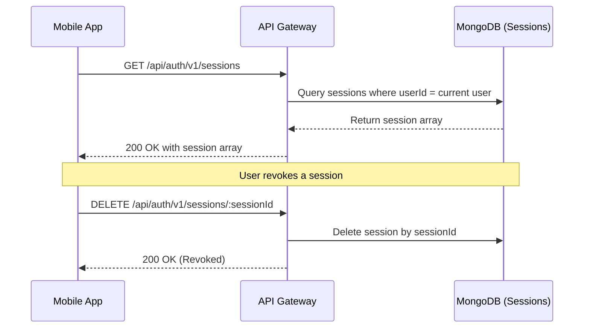
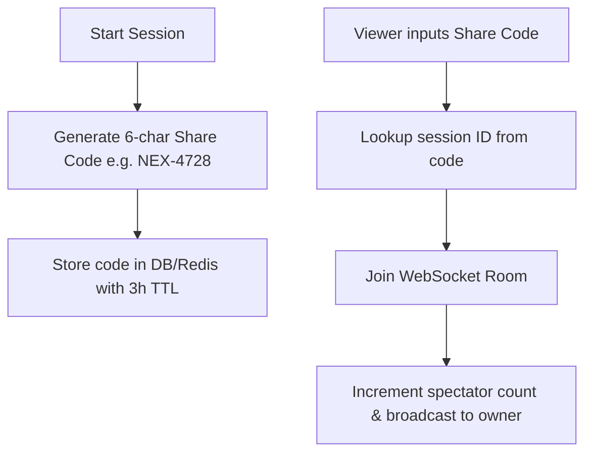

# NexFit Backend API Improvements: Architectural Validation

This document evaluates the 9 proposed production improvements, comparing them to the active codebase, mapping out dependencies, and recommending an implementation workflow.

---

## Executive Summary

| Topic | Proposed Improvement | Current Status in Codebase | Recommendation | Priority |
| :--- | :--- | :--- | :--- | :--- |
| **1** | Device Session Management | Session schema tracks devices; missing list/delete APIs | **Implement** `GET` & `DELETE` endpoints | High |
| **2** | Live Session Sharing | Sessions exist; missing share code & spectate logic | **Implement** share link generation & QR payload | High |
| **3** | Dashboard Aggregation | Aggregates are done per-module; no single summary API | **Implement** `/v1/dashboard` endpoint | Medium |
| **4** | Health Integration | Sync relies on workout end; no raw health data sync | **Implement** Apple/Android health connectors | Medium |
| **5** | Device Registration | FCM Token saved on login; no standalone endpoint | **Implement** `/v1/devices/register` | High |
| **6** | Route Polyline | Coordinates stored as flat `[[lat, lng]]` arrays | **Implement** Google Polyline Algorithm encoding | Critical |
| **7** | Security Requirements | Rate limits, refresh token rotation, JWT revocation done | **Verify & Document** existing systems | Handled |
| **8** | Session Expiry | RAM-based store exists; missing automatic 3hr TTL | **Implement** Redis/MongoDB auto-expiry | Medium |
| **9** | WebSocket Events | Custom rooms active; missing specific spectator count | **Standardize** event naming | Medium |

---

## 1. Detailed Validation & Design

### Item 1: Device Session Management
> [!NOTE]
> The database already defines a Mongoose session store matching active devices, including metadata fields (`deviceId`, `platform`, `appVersion`, `lastActiveAt`). However, there are no endpoints to list or revoke specific sessions.

#### Proposed Architecture


*   **Endpoint 1:** `GET /api/auth/v1/sessions`
*   **Endpoint 2:** `DELETE /api/auth/v1/sessions/:sessionId`
*   **revocation flow:** If a session is deleted, the authentication middleware (`auth.middleware.ts`) will automatically reject any subsequent requests carrying a JWT with that session's ID (`sid` claim).

---

### Item 2: Live Session Sharing & Spectators
Currently, viewing a live session requires knowing the long UUID `sessionId`. To support quick code sharing (e.g., Apple watch to mobile, or SMS sharing):
1.  **Share Code Generation:** When starting or sharing a session, generate a human-readable token (e.g., `NEX-4728`) backed by a short-lived lookup index in Redis/MongoDB.
2.  **Viewer Count Tracking:** Track active spectator sockets in the Room via Socket.io `io.sockets.adapter.rooms.get(roomName).size` or an active viewers Redis counter, and broadcast updates to the room.



---

### Item 3: Dashboard Aggregation API
Fitness dashboards require combining stats from multiple domains. Fetching steps, distance, activities count, streaks, and weekly achievements requires 4-5 round-trips from a mobile device, which degrades battery and performance.
*   **Design:** A single endpoint `GET /v1/dashboard` performing a parallel Mongoose aggregation pipeline over the `activities`, `steps`, and `streaks` collections for the current user.

---

### Item 4: Health Integration Sync
To support seamless synchronization with iOS Apple HealthKit and Android Health Connect:
*   `POST /v1/health/apple/connect` and `POST /v1/health/android/connect` to store integration state status.
*   `POST /v1/health/sync` to ingest batches of steps, active calories, and distance.
*   **Payload Example:**
    ```json
    {
      "steps": 10234,
      "distanceMeters": 7420,
      "calories": 532,
      "source": "apple_health",
      "timestamp": "2026-05-31T08:00:00Z"
    }
    ```

---

### Item 5: Standalone Push Device Registration
A dedicated endpoint to update FCM tokens is vital. Mobile OS platforms rotate FCM tokens dynamically during background refresh cycles. Separating this from the login flow ensures push reliability.
*   **Route:** `POST /v1/devices/register`
*   **Schema:** `{ "deviceId": "...", "platform": "...", "fcmToken": "..." }`

---

### Item 6: Polyline Route Compression
Storing raw coordinate arrays (e.g., `[[lat, lng], [lat, lng], ...]`) is extremely expensive for database storage and network bandwidth. 

> [!TIP]
> The **Google Encoded Polyline Algorithm** compresses coordinates by converting latitude/longitude deltas into a compact string of ASCII characters. 

*   **Compression Factor:** ~80-90% database storage reduction.
*   **Payload Change:**
    ```diff
    - "routeCoordinates": [ [37.7749, -122.4194], [37.7752, -122.4201] ]
    + "routePolyline": "_p~iF~ps|U_ulLnnqC"
    ```
*   **Implementation:** Introduce the npm `polyline` package or write a lightweight utility function. Encode coordinates when syncing completed workouts, and decode them in the replay loader.

---

### Item 7: Security Architecture (Already Handled)
Many security requirements suggested by ChatGPT are **already successfully implemented** in our backend codebase:

| Security Feature | Active Implementation in Codebase |
| :--- | :--- |
| **Login Rate Limiting** | Handled in `auth.routes.ts` via `loginLimiter` (10 requests per 15 mins). |
| **Signup Rate Limiting** | Handled via `signupLimiter` (5 requests per 1 hour). |
| **Reset Password Limiter**| Handled via `authLimiter` (100 requests per 15 mins). |
| **Token Rotation** | Implemented in `/refresh` route; new token pair issued, old session token rotated. |
| **JWT Revocation** | Middleware queries database session status on every authenticated call. |

---

### Item 8: Live Session Expiry
To prevent lingering or abandoned sessions from taking up system memory:
*   Add a Mongoose TTL index or Redis expiration on live sessions of 3 hours.
*   Trigger an automatic socket room purge when a session is closed or expires.

---

### Item 9: WebSocket Events Naming Standard
Aligning event names improves developer experience. The existing codebase uses:
*   Client: `live:join-session`, `live:coords`, `live:end-session`
*   Server: `live:session-started`, `live:coords-updated`, `live:session-ended`

We can add aliases or update these names to match ChatGPT's suggestions (`joinSession`, `leaveSession`, `locationUpdate`, `viewerCountUpdated`) for absolute consistency across frontend clients.

---

## 2. Recommended Roadmap & Next Steps

1.  **Phase 1: Performance & Security (Highest Impact)**
    *   Implement **Polyline Compression** to optimize storage and speed up coordinate streaming.
    *   Expose **Device Session Management** APIs to allow active session monitoring and remote revokes.
2.  **Phase 2: Real-time Sharing & Dashboard**
    *   Introduce short-code lookups for live-sessions (`NEX-4728`) and spectator counts.
    *   Implement the `/v1/dashboard` aggregation API.
3.  **Phase 3: Integrations**
    *   Implement Health Sync endpoints and dedicated device FCM token registration.
