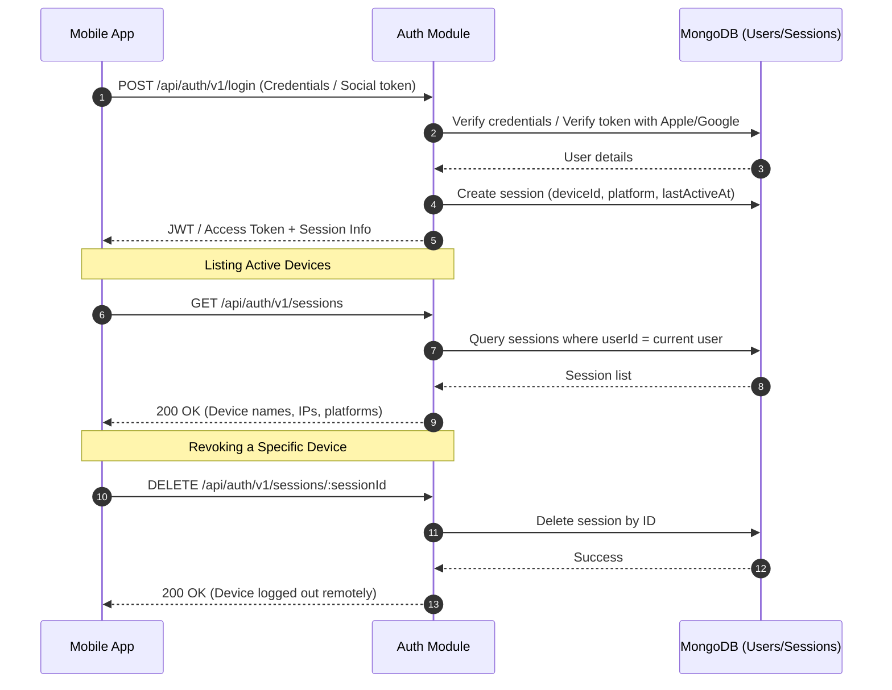
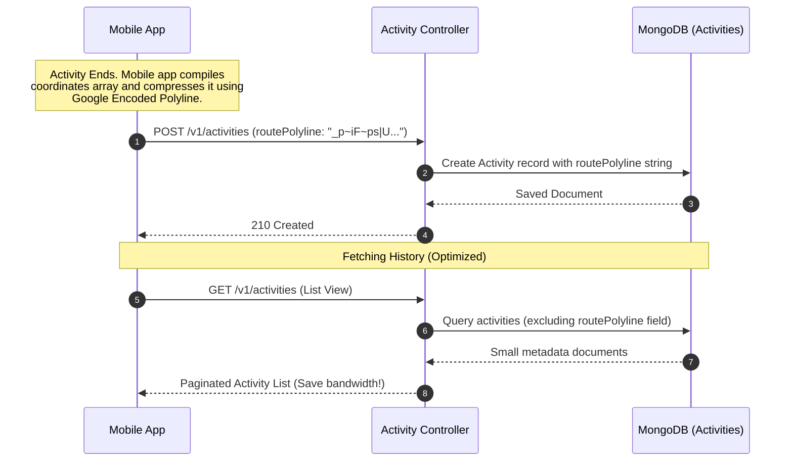
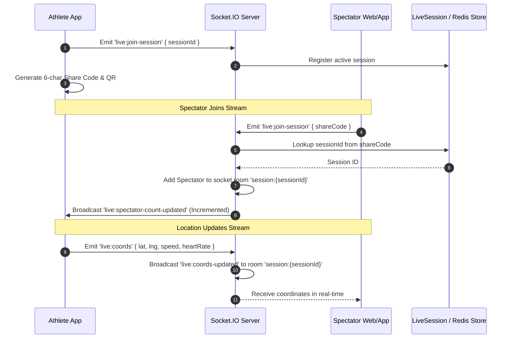
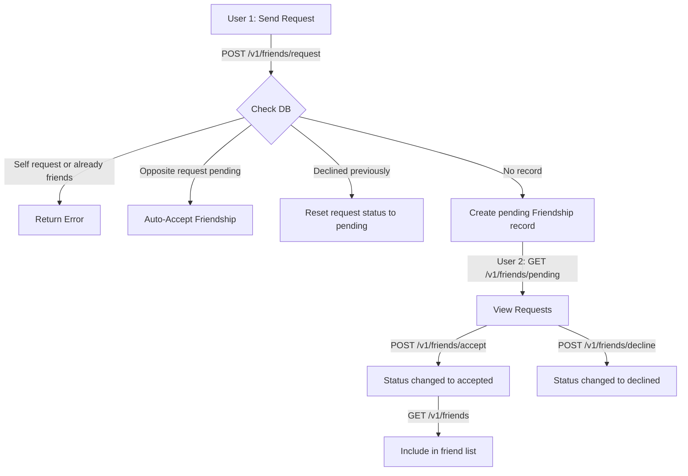
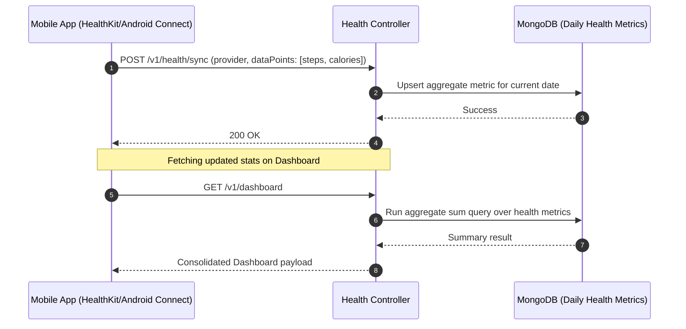

# NexFit Backend: Product Summary & Detailed User Flows

This document provides a comprehensive analysis of the NexFit backend product architecture, feature roadmap, and end-to-end user journeys.

---

## 1. Product & Architecture Overview

NexFit is a high-performance fitness-tracking monolithic backend built with Node.js, Express, MongoDB (via Mongoose), Redis, and Socket.IO. The platform provides:
*   **Secure Authentication:** Traditional email/password, session listing, device revocation, and Google/Apple social login.
*   **Activity Tracking:** Post-activity sync with Google Polyline compression, and a replay engine.
*   **Live Session Streams:** WebSockets-based real-time tracking with rooms, spectator count monitoring, and QR-based short code sharing.
*   **Social & Groups System:** Public and invite-only groups, join tokens, and a bidirectional friendship engine.
*   **Health Integrations:** Daily sync of Apple Health and Android Health Connect metrics.

---

## 2. Plan Summary & Status (v1.1 Roadmap)

| Module | Feature | Status | Technology |
| :--- | :--- | :--- | :--- |
| **Auth & Security** | Rate Limiting (Signup/Login) | **Active** | `express-rate-limit` |
| | Device Session Revocation | **Active** | `better-auth` + session models |
| **Activities** | Google Polyline Compression | **Active** | `routePolyline` schema mapping |
| | Activity Replay Engine | **Active** | `GET /v1/replay/:activityId` |
| **Live Tracking** | WebSocket Room Management | **Active** | Socket.IO (room namespaces) |
| | QR & 6-Char Code Sharing | **Active** | Dynamic token verification & short code lookup |
| | Live Spectator Analytics | **Active** | Socket room size broadcasting |
| **Social & Groups** | Group Membership & Invites | **Active** | UUID tokens, Mongoose references |
| | Friend System | **Active** | Bidirectional `Friendship` model |
| **Health & Stats** | Dashboard Aggregation | **Active** | Parallel Mongoose Aggregation Pipelines |
| | Health Connect / Apple Health | **Active** | Batch metric sync endpoint |
| **Infrastructure** | Cloud Tunneling | **Active** | Cloudflare Tunnels (`cloudflared`) |
| | Event Queue / Background Worker | **Active** | BullMQ |
| | Caching layer | **Pending** | Redis cache decorators (Dashboard) |

---

## 3. Detailed User Flows & Sequences

### Flow A: User Authentication & Device Revocation
Secures logins, supports multiple mobile devices, and handles remote logouts.

---

### Flow B: Activity Sync & Google Polyline Compression
Saves database storage and network bandwidth by transforming raw coordinates into a single string.

---

### Flow C: Live Session Sharing & Spectators
Allows users to stream GPS location to friends and spectators via QR/Short code.

---

### Flow D: Bidirectional Friend System
Enables social connectivity and updates feed permissions.

---

### Flow E: Health Ecosystem Integration
Performs asynchronous bulk ingestion of fitness metrics from mobile operating systems.

---

## 4. Product Scalability & Production Readiness

1.  **Stateless Execution:** The Express application is completely stateless, making it fully ready to be deployed behind a Google Cloud Run load balancer.
2.  **External Storage Architecture:** Relies on external MongoDB Atlas database cluster and Upstash Redis instance to manage WebSocket session coordination.
3.  **Background Processing:** Utilizes `BullMQ` for offloading transactional emails and resource-intensive activity analyses away from the API request-response loop.
